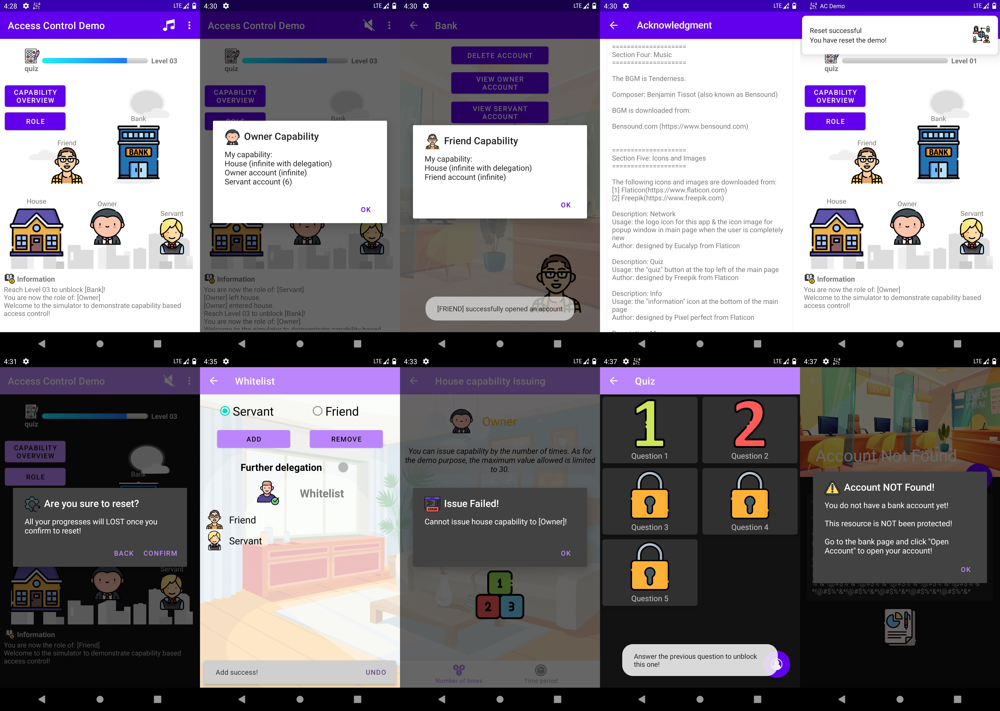
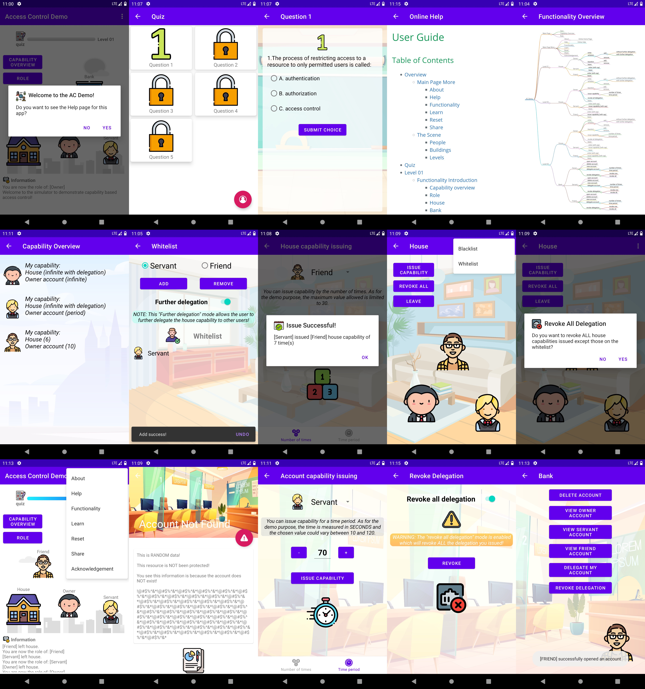
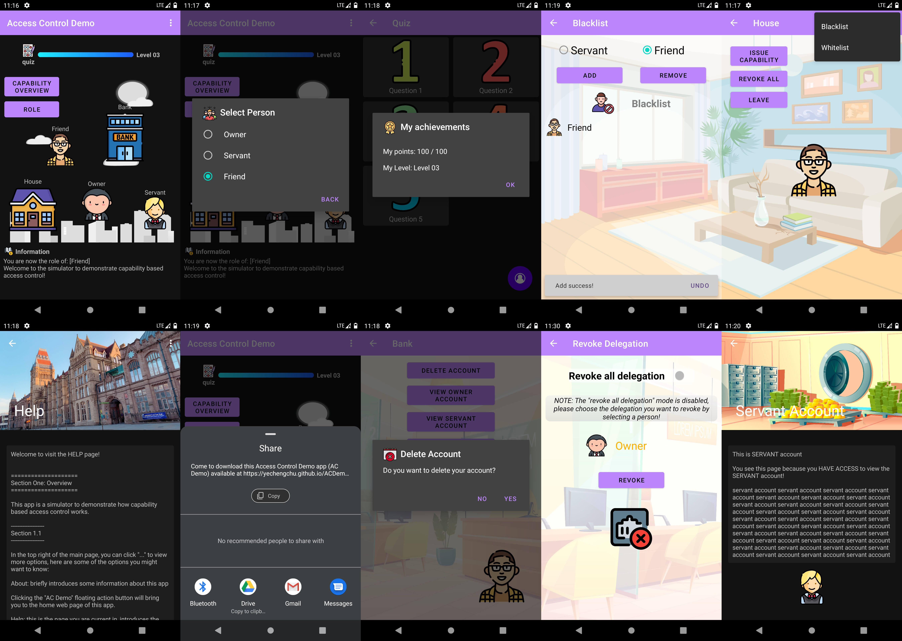
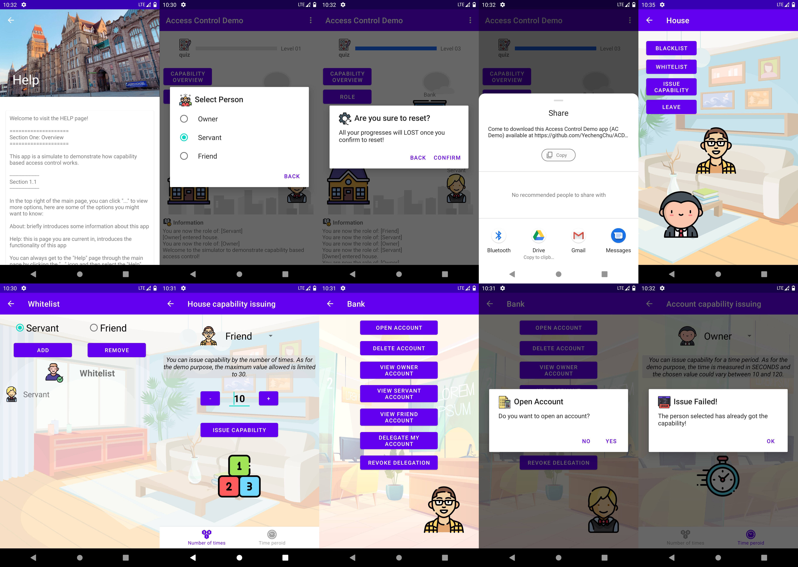

# Image Gallery
Here are some demo images of the __ACDemo__ app.

## Latest version (Version 2.1)

The appearance of the app remains almost the same as __Version 2.0__. 

Only few changes have been made in this latest version:

- Add BGM :musical_note:.
- Compress images used in the app, so the size of apk​ :package: reduced from around 40MB to around 20MB.
- Implemented onUpgrade function in Database, so there will not be any exception for quiz when the user update their app directly from __Version 1.0__ to __Version 2.1__.
- :warning: However, there is still some problem for the issued _infinite_ capabilities. Please check the capabilities after installing and revoke those incorrect ones, sorry for that :sob:.

## Version 2.0

- There is significant change in the functionality provided. Also, several changes have been made to improve the appearance of the app.

- This version can be downloaded [here](https://github.com/YechengChu/ACDemo/raw/master/ACDemo.apk).

- :warning: Warning: If your phone already installed __Version 1.0__, please _uninstall_ the app, otherwise it will quit when you trying to enter the quiz page !!! :disappointed:

## Normal Mode / Light Mode (Version 2.0)

- The appearance when the dark mode of the Android phone is turned off.

## Dark Mode (Version 2.0)
- The appearance when the dark mode of the Android phone is turned on.

## Older Version (Version 1.0)

- These images are from an older version of this app.
- This version is also available [here](https://github.com/YechengChu/ACDemo/raw/master/ACDemo_old.apk).
- :warning: Note that, in this older version, the quiz part has not been implemented yet!

