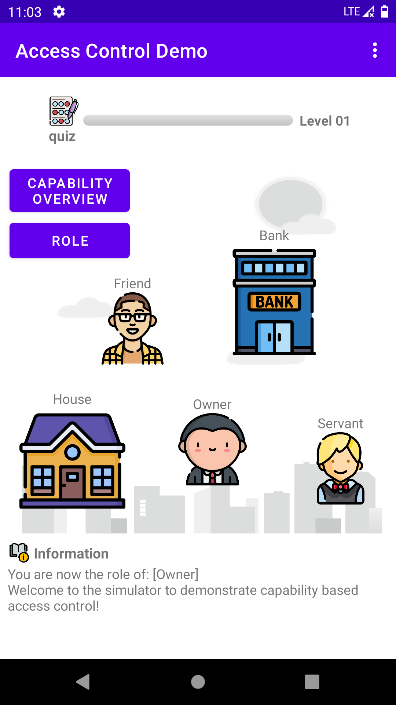

# Access Control Demo

- __AC Demo__ is an _Android App_ :iphone: of a simulator to demonsrate how the capability based access control works. It can be _downloaded_ and _installed_ on your Android phone.

- New an [issue](https://github.com/YechengChu/ACDemo/issues/new) on the GitHub :octocat: or [email](mailto:yecheng.chu@student.manchester.ac.uk) me :email: if you have any suggestion for this app or spot any problem!

